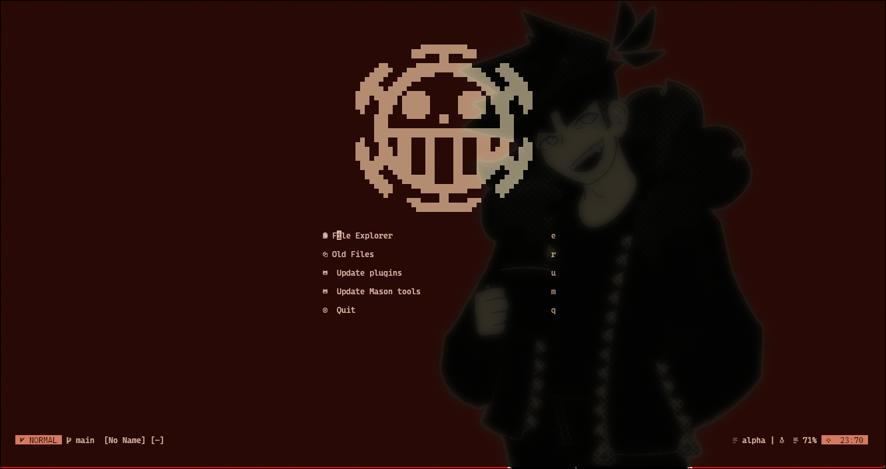
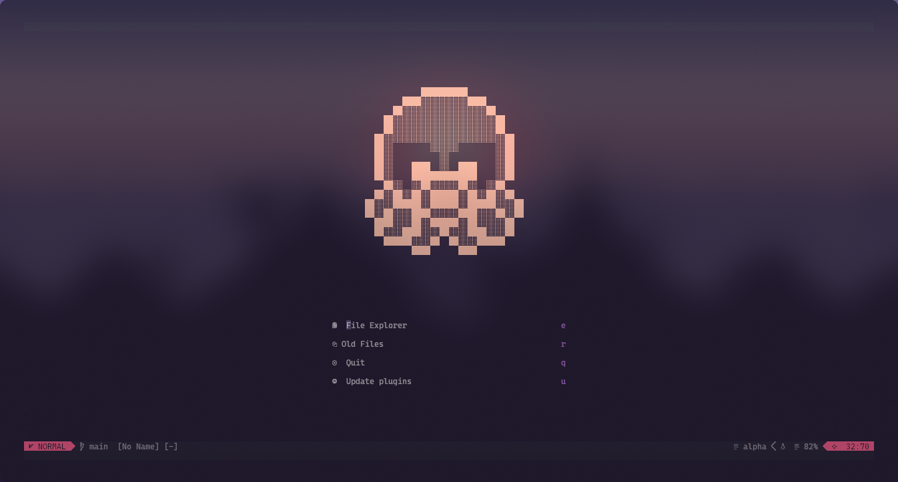
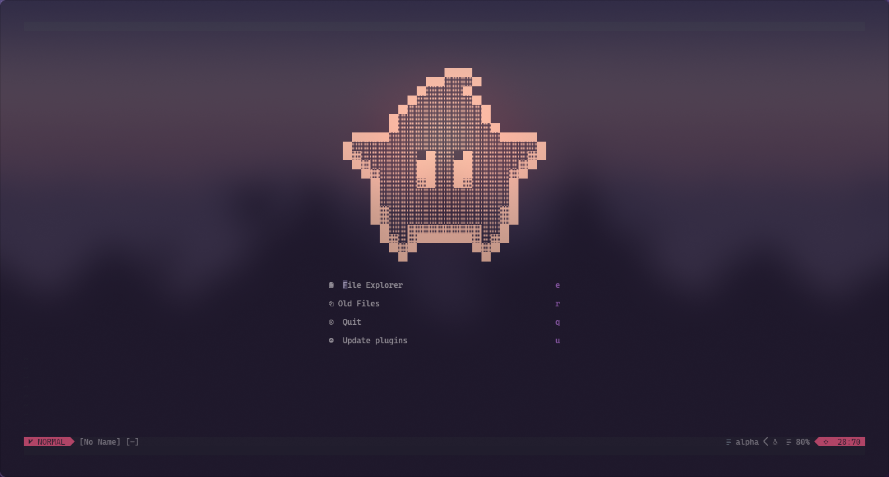
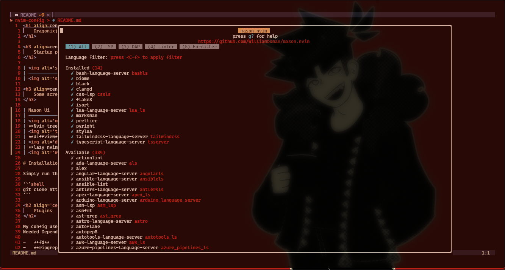
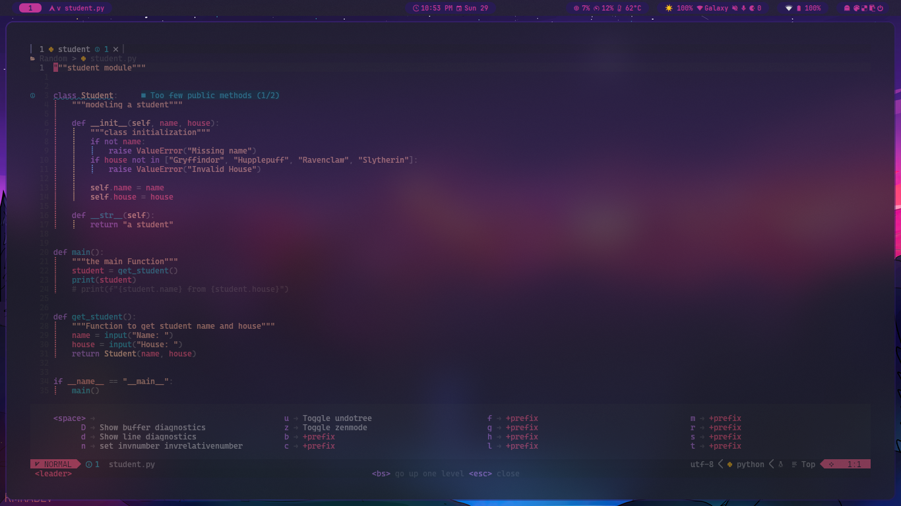
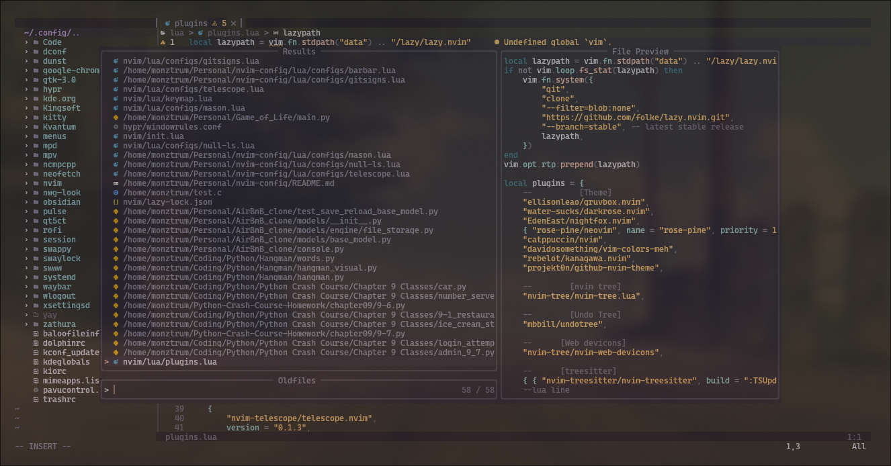
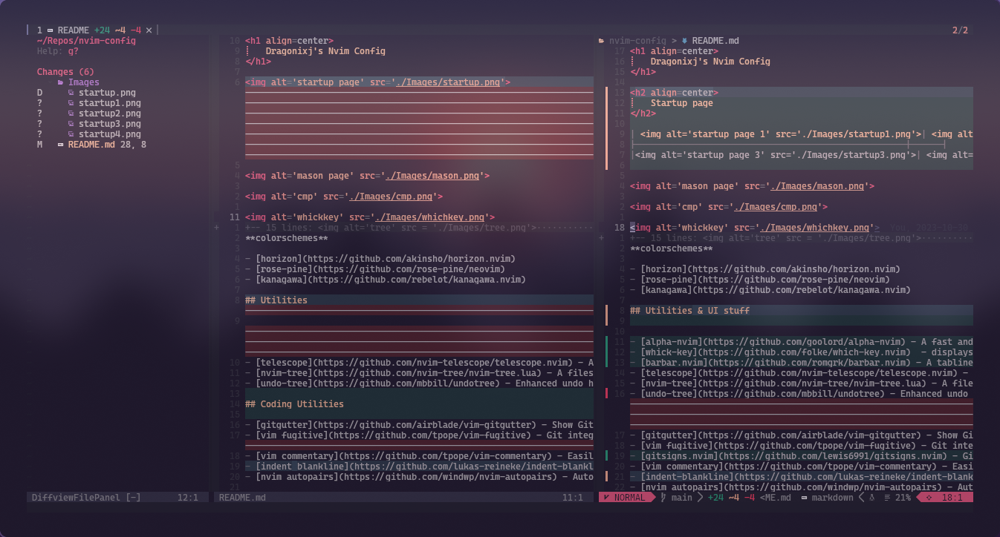
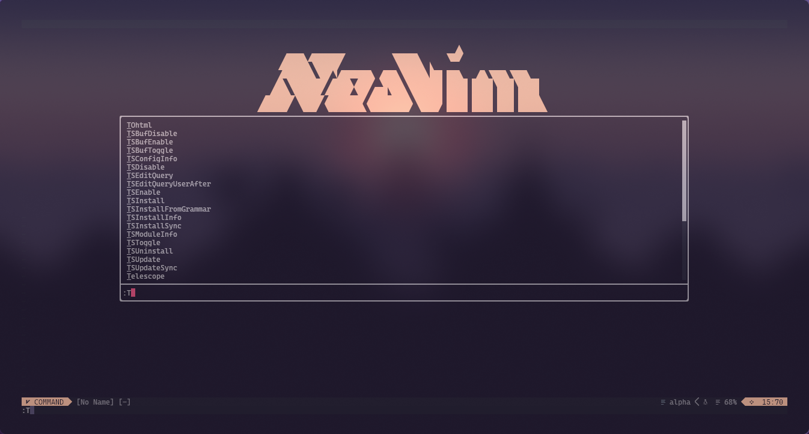
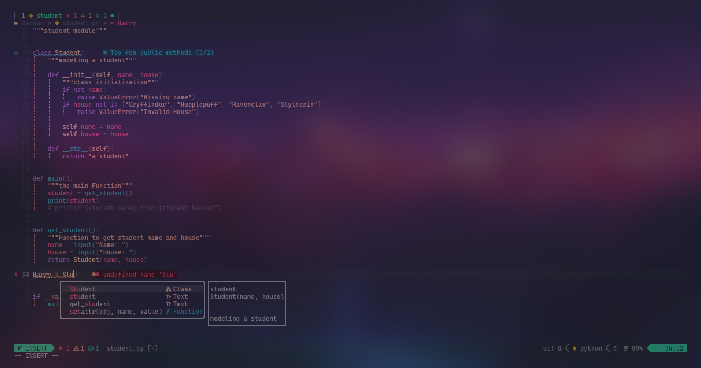

<h1 align=center>
    Dragonixj's Nvim Config
</h1>

<h3 align=center>
    Startup page
</h3>

|  |  |
| ------------------------------------------------------ | ------------------------------------------------------ |
|  |  |

<h3 align=center>
    Some screenshots
</h3>

| Mason Ui                                          | Whickkey UI                                          |
| ------------------------------------------------- | ---------------------------------------------------- |
|    |                     |
| **Nvim tree**                                     | **Telescope UI**                                     |
|         |    |
| **diffview**                                      | **toggleterm**                                       |
|   |  |
| **wilder menu**                                   | **cmp**                                              |
|  |                |

<h1 align='center'>
    Plugins
</h1>

My config uses [lazy](https://github.com/folke/lazy.nvim) to manage plugins.
Needed Dependencies

-   fd
-   ripgrep
-   chafa

## status line and colorschemes

-   [lualine](https://github.com/catppuccin/nvim) - A customizable status line

**colorschemes**

-   [horizon](https://github.com/akinsho/horizon.nvim)
-   [rose-pine](https://github.com/rose-pine/neovim)
-   [kanagawa](https://github.com/rebelot/kanagawa.nvim)

## Utilities & UI stuff

-   [alpha-nvim](https://github.com/goolord/alpha-nvim) - A fast and fully programmable greeter/dashboard
-   [whick-key](https://github.com/folke/which-key.nvim) - displays a popup with possible keybindings of the keys pressed
-   [barbar.nvim](https://github.com/romgrk/barbar.nvim) - A tabline plugin with amazing features
-   [telescope](https://github.com/nvim-telescope/telescope.nvim) - A highly extendable fuzzy finder
-   [nvim-tree](https://github.com/nvim-tree/nvim-tree.lua) - A files system navigator
-   [undo-tree](https://github.com/mbbill/undotree) - Enhanced undo history management
-   [gitgutter](https://github.com/airblade/vim-gitgutter) - Show Git changes in the sign column.
-   [vim fugitive](https://github.com/tpope/vim-fugitive) - Git integration for Neovim.
-   [gitsigns.nvim](https://github.com/lewis6991/gitsigns.nvim) - Git integration for buffers
-   [vim commentary](https://github.com/tpope/vim-commentary) - Easily comment and uncomment lines.
-   [indent-blankline](https://github.com/lukas-reineke/indent-blankline.nvim) - Show indent guides.
-   [nvim autopairs](https://github.com/windwp/nvim-autopairs) - Auto-pairs for Neovim.

## Lsp Tools(formatting,linting,completion etc.)

-   [mason](https://github.com/williamboman/mason.nvim) - Easily install and manage LSP servers,linters and formatters
-   [conform.nvim](https://github.com/stevearc/conform.nvim) - Lightweight yet powerful formatter plugin for neovim
-   [lspkind.nvim](https://github.com/onsails/lspkind.nvim) - LSP Icons
-   [nvim-cmp](https://github/com/hrsh7th/nvim-cmp) - A fast and poweful completion tool
-   [cmp-nvim-lsp](https://github.com/hrsh7th/cmp-nvim-lsp) - LSP completion source for nvim cmp
-   [cmp-nvim-lua](https://github.com/hrsh7th/cmp-nvim-lua) - Lua completion source for nvim-cmp
-   [cmp-path](https://github.com/hrsh7th/cmp-path) - Path source for nvim-cmp.
-   [cmp-buffer](https://github.com/hrsh7th/cmp-buffer) - Buffer source for nvim-cmp.
-   [cmp-nvim-lsp-signature-help](https://github.com/hrsh7th/cmp-nvim-lsp-signature-help) - Signature help source for nvim-cmp.
-   [cmp_luasnip](https://github.com/saadparwaiz1/cmp_luasnip) - Luasnip completion source for nvim-cmp

## Keymaps

_TODO_

## Contributing

This is a personal config, mostly with things that seem to work best for me. However, the repo is always open to good suggestions.
Feel free to fork it and customize it to your own liking, or to create PRs with improvements.
