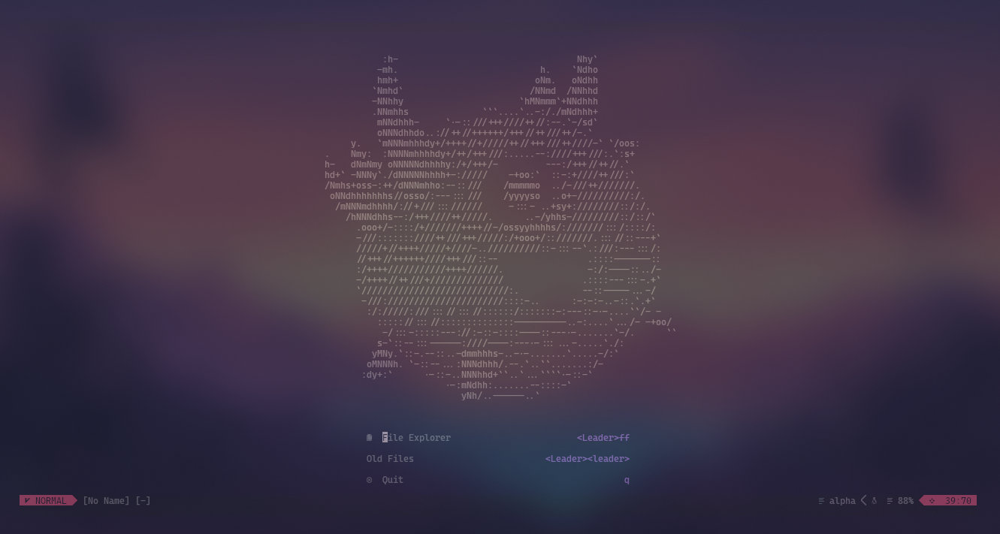

## Neovim setup

This setup requires [Neovim](https://neovim.io/) (>= 0.8)

## Plugins

My config uses [lazy](https://github.com/folke/lazy.nvim) to manage plugins.

### status line and colorschemes

- [lualine](https://github.com/catppuccin/nvim) - A customizable status line

**colorschemes**

- [horizon](https://github.com/akinsho/horizon.nvim)
- [rose-pine](https://github.com/rose-pine/neovim)
- [kanagawa](https://github.com/rebelot/kanagawa.nvim)

### Utilities

- [telescope](https://github.com/nvim-telescope/telescope.nvim) - A highly extendable fuzzy finder
- [nvim-tree](https://github.com/nvim-tree/nvim-tree.lua) - A files system navigator
- [undo-tree](https://github.com/mbbill/undotree) - Enhanced undo history management

### Lsp and Completions
