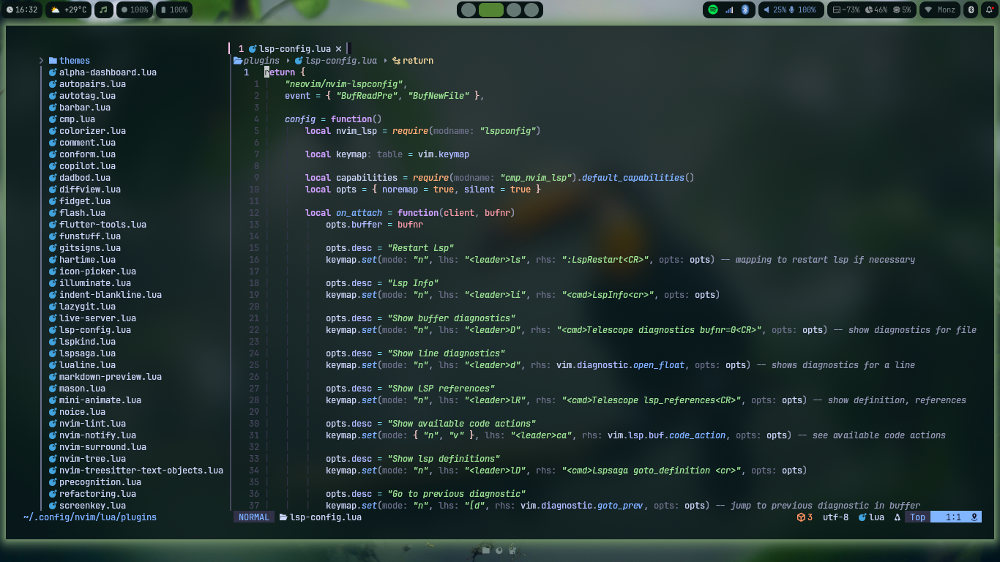
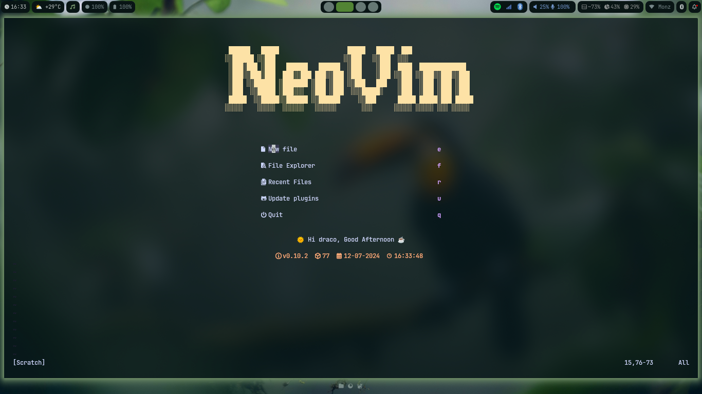
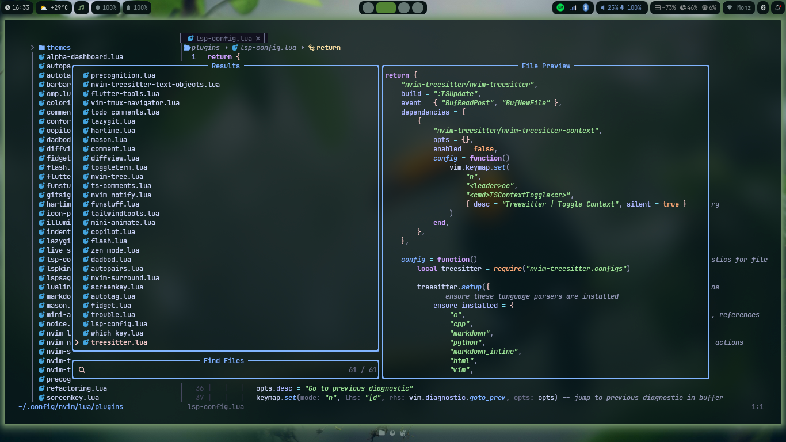

<div align=center>


[](https://github.com/neovim/neovim)




</div>

## ⚡️ Requirements

-   Neovim >= 0.10.0
-   Git
-   Curl
-   nodejs
-   npm
-   ripgrep
-   fd

## 🛠️ Installation

1. Clone the repository into your NeoVim config directory.

```shell
git clone https://github.com/m0nztrum/nvim-config.git ~/.config/nvim
```

2. Run a checkhealth inside nvim

```
:checkhealth
```

## 📁 Folder and File Structure

```shell
~/.config/nvim
├── lua
│   ├── core
│   │   ├── autocmds.lua        # File for all autocmds
│   │   ├── keymaps.lua         # File for keybindings
│   │   ├── lazy.lua            # Lazy bootstrap
│   │   └── options.lua         # All neovim options
│   ├── plugins                 # All plugins
│   │   ├── plugin-1.lua
│   │   ├── plugin-2.lua
│   │   ├── **
│   │   └── plugin-x.lua
│   ├── ascii-headers.lua       # ascii for startup page
│   └── .luarc.json
├── init.lua
├── .prettierrc.json            # for defaults (conform)
└─.stylua.toml
```

<h2 align='center'>
   🔌 Plugins
</h2>

## Package Manager

-   [lazy.nvim](https://github.com/folke/lazy.nvim) - A modern plugin manager.

## status line and colorschemes

-   [lualine](https://github.com/catppuccin/nvim) - A customizable status line

## colorschemes

-   [kanagawa](https://github.com/rebelot/kanagawa.nvim)
-   [catppuccin](https://github.com/catppuccin/nvim)
-   [gruvbox](https://github.com/ellisonleao/gruvbox.nvim)
-   [solarized-osaka](https://github.com/craftzdog/solarized-osaka.nvim)
-   [nightfox](https://github.com/EdenEast/nightfox.nvim.git)

## Utilities & UI stuff

-   [alpha-nvim](https://github.com/goolord/alpha-nvim) - A fast and fully programmable greeter/dashboard
-   [whick-key](https://github.com/folke/which-key.nvim) - displays a popup with possible keybindings of the keys pressed
-   [barbar.nvim](https://github.com/romgrk/barbar.nvim) - A tabline plugin with amazing features
-   [telescope](https://github.com/nvim-telescope/telescope.nvim) - A highly extendable fuzzy finder
-   [nvim-tree](https://github.com/nvim-tree/nvim-tree.lua) - A files system navigator
-   [undo-tree](https://github.com/mbbill/undotree) - Enhanced undo history management
-   [indent-blankline](https://github.com/lukas-reineke/indent-blankline.nvim) - Show indent guides.
-   [nvim autopairs](https://github.com/windwp/nvim-autopairs) - Auto-pairs for Neovim.

## Treesitter

-   [nvim-treesitter](https://github.com/nvim-treesitter/nvim-treesitter) - Neovim Treesitter configurations and abstraction layer.
-   [nvim-treesitter-context](https://github.com/nvim-treesitter/nvim-treesitter-context) - Shows the context of the currently visible buffer contents.
-   [nvim-treesitter-textobjects](https://github.com/nvim-treesitter/nvim-treesitter-textobjects) - Syntax aware text-objects, select, move, swap, and peek support.

## Git integration

-   [diffview.nvim](https://github.com/sindrets/diffview.nvim) - Interface for easily cycling through diffs.
-   [gitsigns](https://github.com/lewis6991/gitsigns.nvim) - Git integration: signs, hunk actions, blame, etc.

## Lsp Tools(formatting,linting)

-   [nvim-lspconfig](https://github.com/neovim/nvim-lspconfig) - Configurations for the LSP client.
-   [mason](https://github.com/williamboman/mason.nvim) - Install and manage LSP servers.
-   [mason-lspconfig](https://github.com/williamboman/mason-lspconfig.nvim) - Bridge between mason and lsp-ocnfig.
-   [trouble.nvim](https://github.com/folke/trouble.nvim) - A pretty diagnostics, references, telescope results, quickfix and location list.
-   [conform.nvim](https://github.com/stevearc/conform.nvim) - Lightweight yet powerful formatter plugin for neovim
-   [lspkind.nvim](https://github.com/onsails/lspkind.nvim) - LSP Icons

## Completion

-   [nvim-cmp](https://github/com/hrsh7th/nvim-cmp) - A fast and poweful completion tool
-   [cmp-nvim-lsp](https://github.com/hrsh7th/cmp-nvim-lsp) - LSP completion source for nvim cmp
-   [cmp-nvim-lua](https://github.com/hrsh7th/cmp-nvim-lua) - Lua completion source for nvim-cmp
-   [cmp-path](https://github.com/hrsh7th/cmp-path) - Path source for nvim-cmp.
-   [cmp-buffer](https://github.com/hrsh7th/cmp-buffer) - Buffer source for nvim-cmp.
-   [cmp-nvim-lsp-signature-help](https://github.com/hrsh7th/cmp-nvim-lsp-signature-help) - Signature help source for nvim-cmp.
-   [cmp_luasnip](https://github.com/saadparwaiz1/cmp_luasnip) - Luasnip completion source for nvim-cmp
-   [tailwind-colorizer-cmp](https://github.com/roobert/tailwindcss-colorizer-cmp.nvim.git) Color hints for tailwind

## Comments

-   [Comment.nvim](https://github.com/numToStr/Comment.nvim) - Smart and powerful comment plugin.
-   [todo-comments.nvim](https://github.com/folke/todo-comments.nvim) - Highlight, list and search todo comments in your projects.
-   [ts-comments](https://github.com/folke/ts-comments.nvim.git)
-   [nvim-ts-context-commentstring](https://github.com/JoosepAlviste/nvim-ts-context-commentstring.git)

## Writing

-   [markdown-preview](https://github.com/iamcco/markdown-preview.nvim) - Preview markdown on your browser.

## Contributing

This is a personal config, mostly with things that seem to work best for me.
However, the repo is always open to good suggestions.
Feel free to fork it and customize it to your own liking, or to create PRs with improvements.
